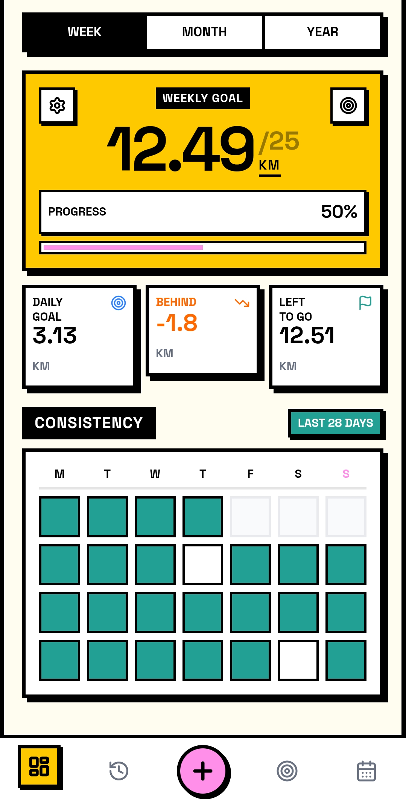
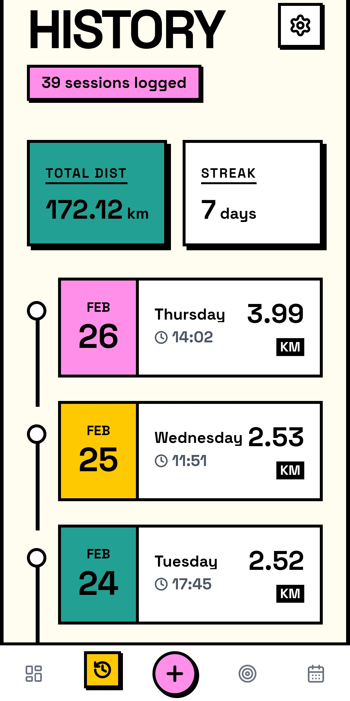
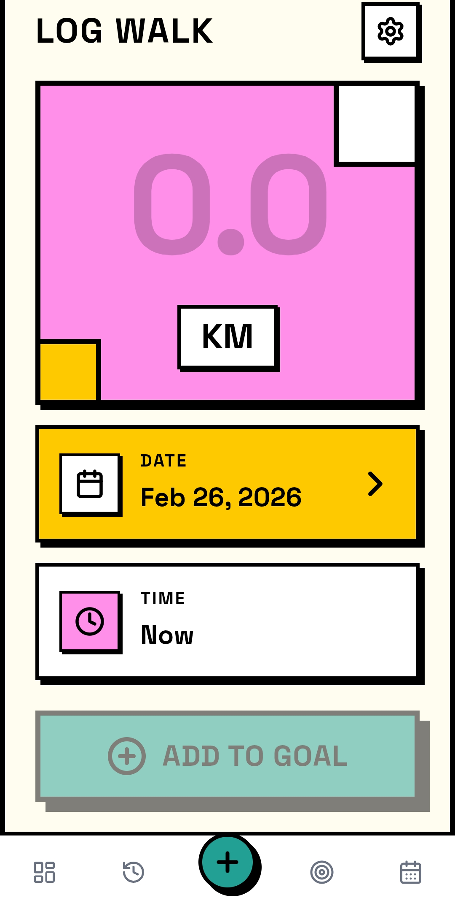
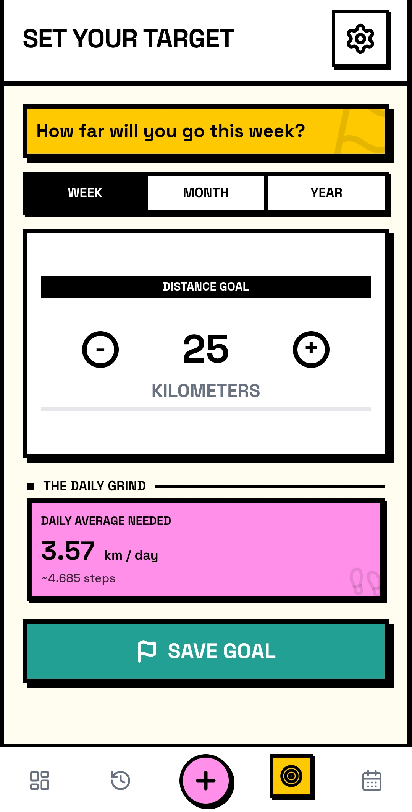
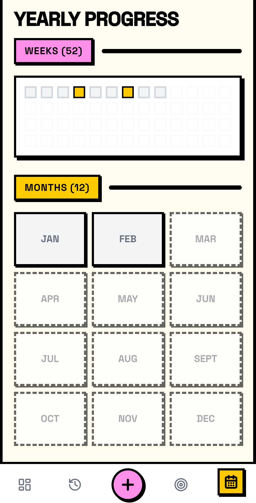
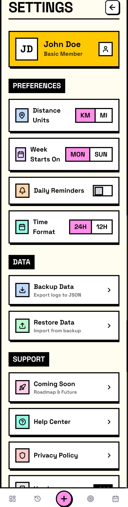

# 🚶‍♂️ WalkGoal

En moderne, lynhurtig og brugervenlig Android-app (.apk) designet til at hjælpe dig med at tracke dine gåture, sætte personlige mål og holde styr på dem. Appen er bygget med fokus på et flot, responsivt design og en gnidningsfri brugeroplevelse på mobil.

---

## 📸 Skærmbilleder

<div align="center">
  
  &nbsp;&nbsp;&nbsp;&nbsp;
  
</div>
<br />
<div align="center">
  
  &nbsp;&nbsp;&nbsp;&nbsp;
  
</div>
<br />
<div align="center">
  
  &nbsp;&nbsp;&nbsp;&nbsp;
  
</div>

---

## ✨ Funktioner

- **📊 Dashboard:** Få det fulde overblik over dagens, ugens og månedens fremskridt direkte på forsiden.
- **🎯 Målsætning:** Sæt personlige mål for, hvor meget du vil gå pr uge, måned og år, og følg med i, hvor tæt du er på at nå dem.
- **📝 Log Gåtur:** Nem og hurtig registrering af distance du har gået for dine seneste gåture.
- **📅 Historik:** Kommer i næste version.
- **⚙️ Indstillinger:** Tilpas appen til dine behov og nem sletning af data.
- **📱 Android App (.apk):** Bygget som en native app via Capacitor, lige til at installere på din Android-telefon.

## 🔒 Data & Privatliv

WalkGoal er bygget med 100% fokus på dit privatliv:
- **Ingen Server:** Appen sender **ingen** data, logbøger eller personlige oplysninger til en server i skyen. 
- **Dit Data Er Dit:** Alt hvad du indtaster (hvor langt du går, tidspunkter, mål osv.) bliver gemt **lokalt på din egen telefon**. Ingen andre end dig har adgang til det.
- **Husk Backup:** Fordi dataene kun ligger på din enhed, er det **meget vigtigt**, at du løbende bruger appens indbyggede "Backup" funktion ("Eksportér Data" i indstillingerne). Hvis du mister din telefon eller sletter appen, er dine data væk, medmindre du har gemt en backup-fil!
- **Fremtidig Medlemsstyring:** Det overvejes at tilføje en form for medlemsstyring i fremtiden. Eftersom dette vil kræve en online server (og derved gå imod appens nuværende kernefilosofi om 100% lokal dataopbevaring), er det endnu ikke endeligt besluttet. Hvis det en dag bliver udviklet, vil det højst sandsynligt blive introduceret som et aktivt og frivilligt tilvalg (opt-in), så man fortsat kan bruge appen 100% lokalt og privat, hvis man foretrækker det.
## 🛠️ Teknologier

Projektet er bygget med moderne webteknologier for at sikre den bedste ydeevne og oplevelse:

- **Frontend Framework:** React 18
- **Programmeringssprog:** TypeScript
- **Styling:** Tailwind CSS (med skræddersyede farvetemaer)
- **Byggeværktøj:** Vite
- **Ikoner:** Lucide React
- **Mobil/Native App:** Capacitor (Bygget til Android / APK)

## 🚀 Kom I Gang (Lokal Kørsel)

For at køre projektet lokalt på din egen maskine:

1. **Klon projektet:**
   ```bash
   git clone https://github.com/KS71/WalkGoal.git
   ```
2. **Gå ind i mappen:**
   ```bash
   cd WalkGoal
   ```
3. **Installer afhængigheder:**
   ```bash
   npm install
   ```
4. **Start appen:**
   ```bash
   npm run dev
   ```

## 👨‍💻 Udvikling & Historik

Appen opdateres løbende. Seneste store opdatering (v2.1.0) inkluderede blandt andet en mere læsevenlig historik-side og finpudsning af indstillingerne.
